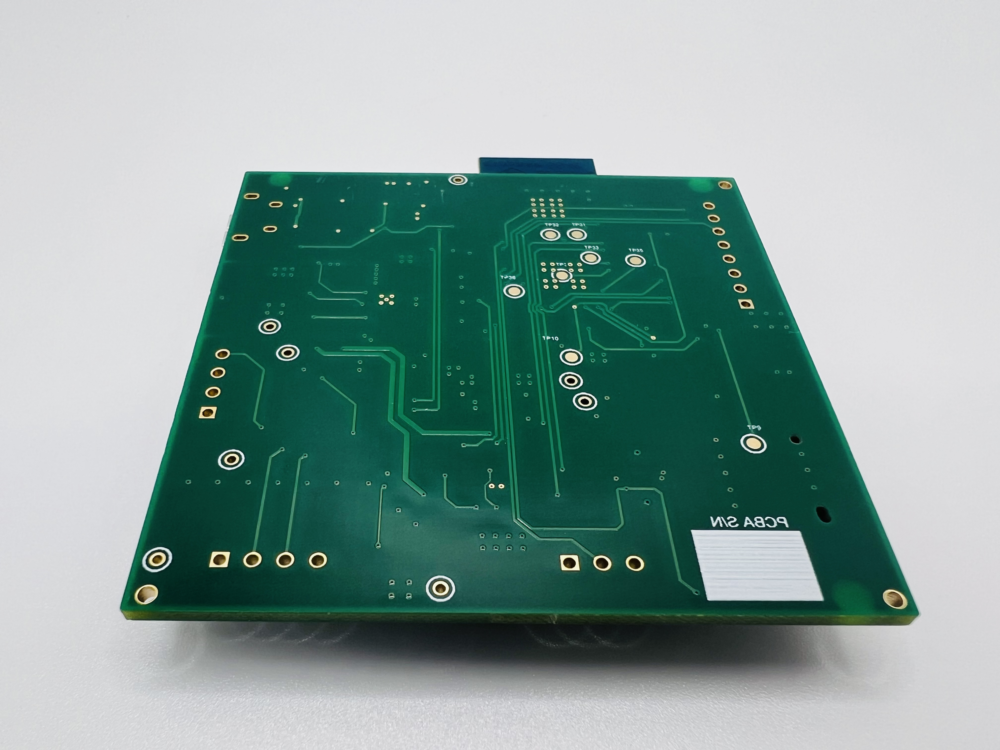
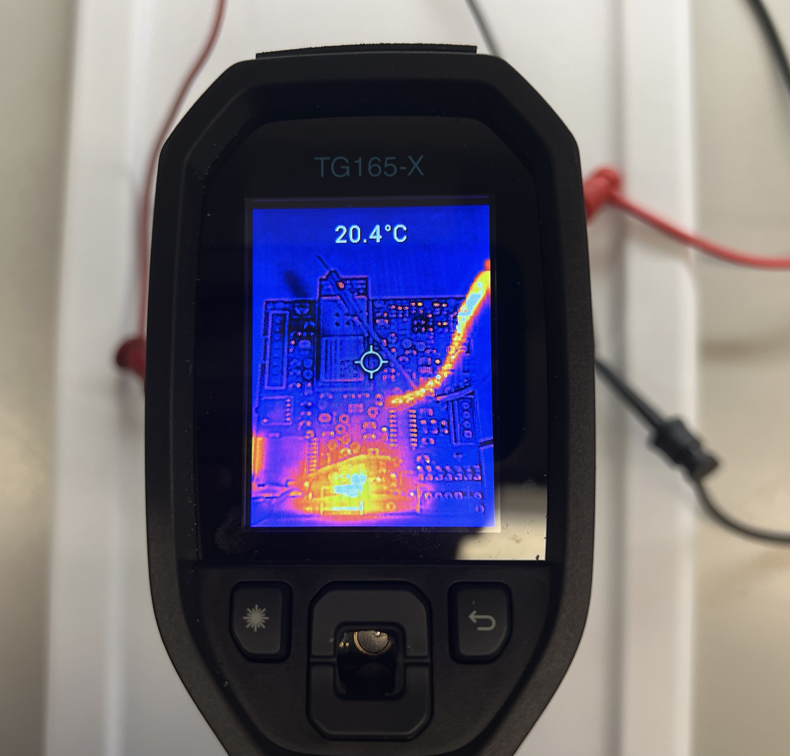
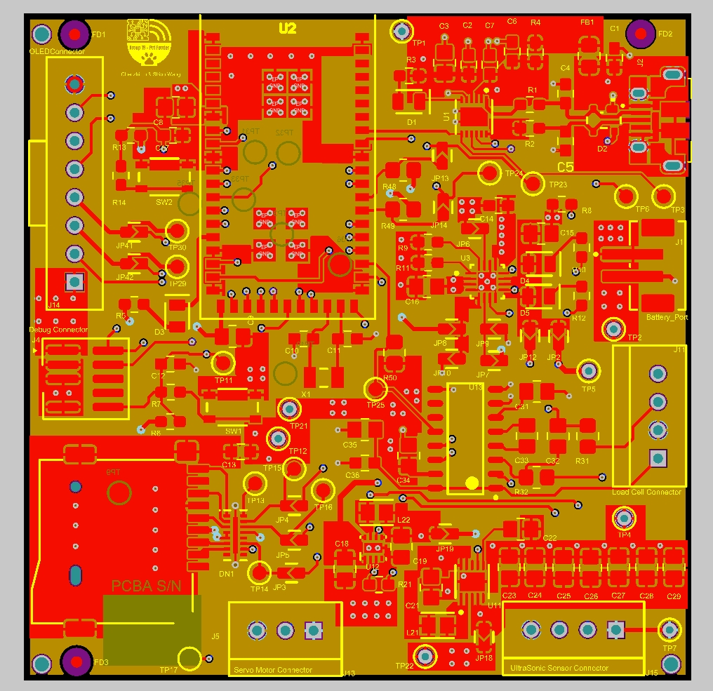
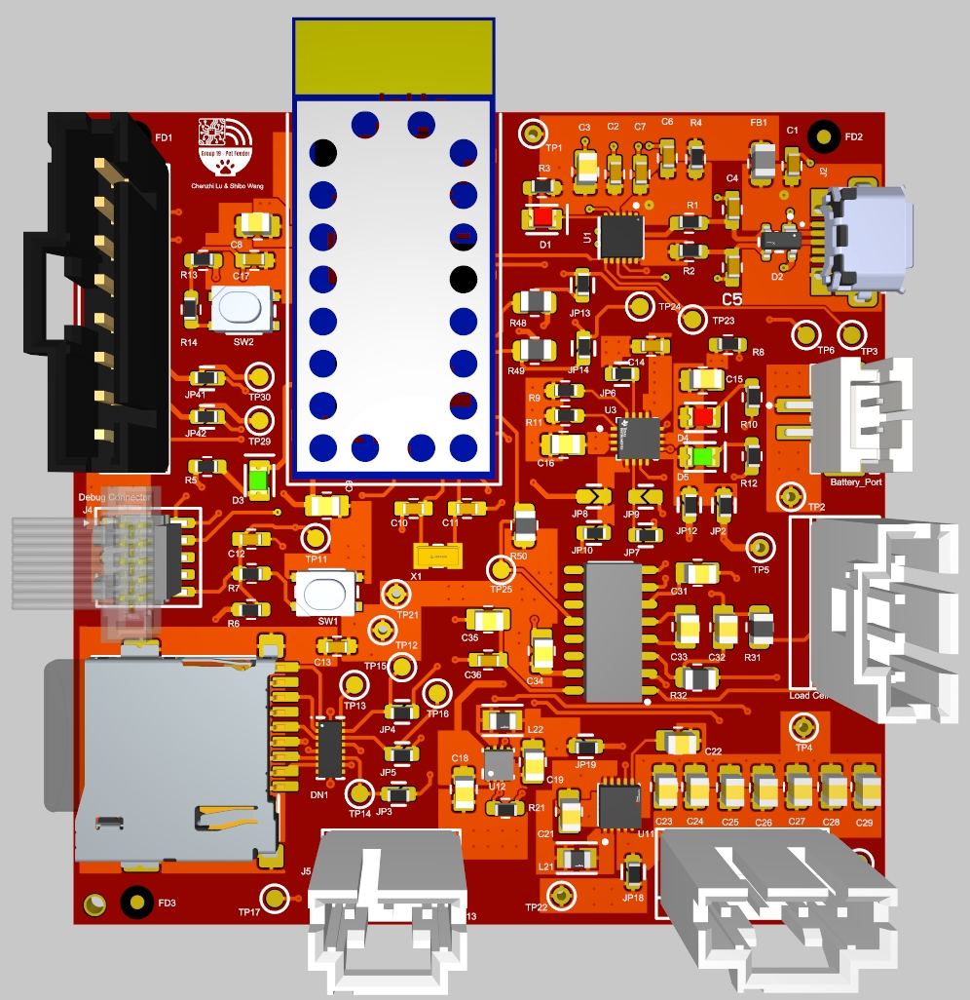
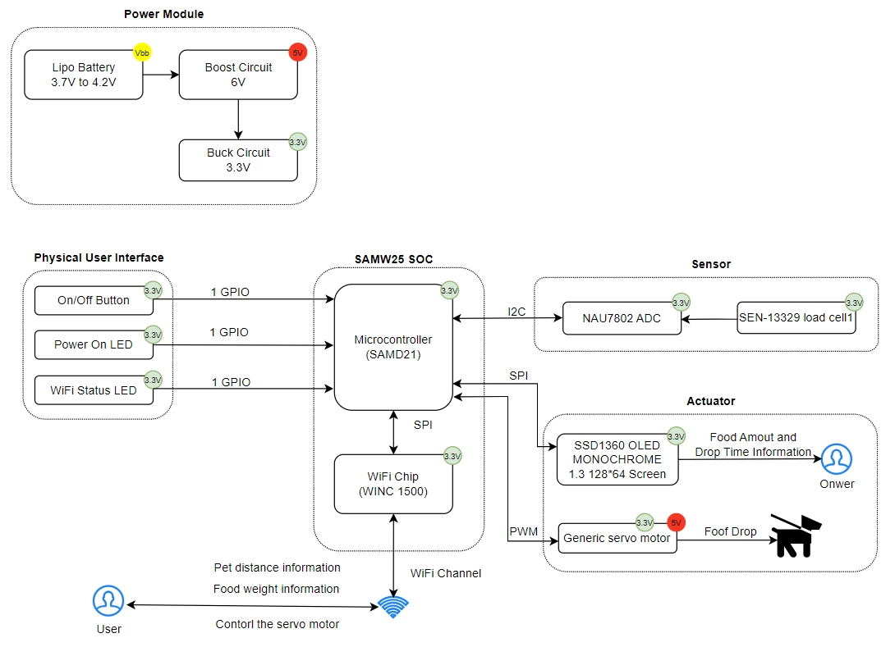

# a14g-final-submission

    * Team Number: 19
    * Team Name: Pet Feeder
    * Team Members: Chenzhi Lu & Shibo Wang
    * Github Repository URL: https://github.com/ese5160/a14g-final-submission-t19-pet-feeder
    * Description of test hardware: Dell XPS13, Windows 11

## 1. Video Presentation

The video link:

## 2. Project Summary

### Device Description

1. SG90 Servo Motor  
The servo motor is used to turn on and off the food storage. It is much more complicated than we expected when we implemented the drivers by ourselves. Since the rotation of the servo angle is controlled by the PWM signals which are generated by the TCC/TC timer counter, not all MCU pins are attached to this function. Fortunately, the pin PA11 we assigned has the TCC1 counter. After the successful generation of the PWM signal, the next problem is how to verify the duty cycle after the system initialization. Once we change the `compare_match` in the `tcc_configure` process, the whole system will get stuck and cashed. We solved it by using the `tcc_set_compare_value` function, where we can change the PWM length by calculating the required timer counter ticks based on the datasheet parameters.

2. Load Cell with NAU7802 ADC  
The load cell is used to measure the weight data and the ADC is used to convert the raw data to the real value, which is communicated with the MCU through the I2C protocol. The problem with this device is that there are numerous registers in the datasheet, which is necessary to find out how to assign them correctly. This is the essential part of the ADC chip working because the wrong initialization of the registers will lead to the unsuccessful value read. After figuring out the correct presetting of the ADC, the calibration and handling of raw data is also a huge problem. In the end, though the real weight converting is still not so accurate, we at least can measure the load cell value with the correct tendency.

3. ST7735 LCD TFT Screen  
The LCD screen is used to display the weight data measured from the load cell, which is connected to the SAMW25 chip by SPI communication. Although we learned the basic initialization and LCD function in the ESE5190 class last semester, we still met unexpected problems in SPI configuration. The SCK and MOSI pins must be under the same SERCOM, and need to be defined with the `CONF_MASTER_PINMUX_PAD`.

4. Internet Augment  
Enable users to control and monitor the device remotely through a web or mobile application. This could involve turning devices on/off(SG90 motor), adjusting settings, or receiving real-time data updates from sensors(load cell). Utilize cloud services to store data collected by the device. This data can then be analyzed to provide insights, trends, or predictive maintenance alerts. Cloud platforms like AWS, Google Cloud, or Microsoft Azure(used in this project) offer various tools for data storage, processing, and analysis. Implement FOTA capabilities to remotely update device firmware. This ensures that devices can receive bug fixes, security patches, or new features without requiring physical access or manual intervention.

### Inspiration

The project is inspired by my friend who has a cute but hungry cat. We need to feed it two or three times per day, but we are very busy studying on campus. Therefore, we want to design a pet feeder that can provide food for the cat at home while we are studying in school.

1. Remote Feeding: Create a system that allows pet owners to feed their pets remotely using a mobile app or web interface. This could be particularly useful for pet owners who are away from home for extended periods.  
2. Scheduled Feeding: Implement scheduling functionality that enables pet owners to set specific times for automatic feeding. This ensures that pets receive their meals on time, even when their owners are busy or away.  
3. Portion Control: Incorporate portion control features that allow pet owners to dispense precise amounts of food for each feeding. This helps prevent overfeeding or underfeeding and ensures that pets receive the appropriate amount of nutrition.  
4. Customizable Diet Plans: Provide pet owners with the ability to create customized diet plans tailored to their pets' specific dietary needs and preferences. This could involve setting different portion sizes or types of food for each meal.
5. Food Monitoring: Integrate sensors or cameras to monitor food levels in the feeder and send alerts when it's time to refill. This helps ensure that pets always have access to food and prevents them from going hungry.

### Device Functionality

The device operation logic is described as follows: The user can press the servo button on the website to control the on/off food storage. Once the food is dropped, the load cell will measure the weight data and upload it to the cloud and process, which is visible on the website. Also, the weight information will be sent to the LCD screen to show the total weight of the food.

### Challenges

We encountered a lot of unexpected problems on this project both in hardware and software.

1. We want to use the TCC timer counter to generate the PWM signal, but we met the problem that once the timer counter compare match value is set in system initialization, it is hard to modify later to change the rotation angle of the motor. We solved it by using the `tcc_set_compare_value` function.
2. Initially, we prepared to use an ultrasonic distance sensor HC-SR04 to detect the location of the pets. We previously thought that this sensor simply needs two GPIO to control, but it needs the trig and echo pin applied with the PWM signals. Unfortunately, the pins we assigned for the trig and echo pins have no TCC counter attached, which cannot support the PWM signal generation. So we cancel this sensor in the end.
3. We met the design problem of connecting the I2C pins `SCL` and `SDA` in the wrong direction, and I attached the `SCL` signal to the PA08 and the `SDA` signal to the PA09. I first wanted to change the codes to solve this problem, but we found that it was hard to achieve since all the pin functions are set as the starter project. Finally, it was solved by disconnecting the I2C jumpers and resoldering the correct connections to make the I2C device work.

### Prototype Learnings

1. We gained extensive knowledge about testing methodologies, testing from the specific region to the entire system. We first tested the function of two power regulators, first testing the boost converter, and then the buck converter. After making sure both the converters are outputting the correct voltage, we tested the whole power module is working. We implemented lots of 0Ohm resistors as jump wires, which proved instrumental in facilitating the measurement of various system components' performance, particularly those that had not been previously explored. Our exposure to standardized testing methodologies has furnished us with invaluable insights and skills that will prove beneficial in our future endeavors.
2. If given the chance to redesign, we might opt to swap out the 0805 packages with the 0603 as it offers better accessibility for measurement purposes. Alternatively, we could incorporate additional test points into the design. Additionally, we aspire to refine the board's layout to make it more compact and increase its density.

### Next Steps

1. We can add more useful functions to the project, such as including a motor driver(DRV8801/DRV8803) to control the water pump, which can provide the pet with not only food but also water to drink.
2. We can implement the feedback control algorithm to add another feeding mode that always fills the food with the fixed value, which will provide the pet the enough food to eat.

### Takeaways from ESE5160

We acquired a wealth of invaluable knowledge throughout our project journey. From the intricacies of PCBA design to the intricacies of programming and firmware uploading, each step presented its own set of challenges and learning opportunities. Notably, we gained significant insights into PCB design and the utilization of FreeRTOS. Additionally, we deepened our understanding of I2C and SPI protocols, which honed our skills in unit testing and debug-thinking, further enriching our learning experience.

### Project links

The Node-RED instance link:

The code repository link:

The Altium 365 link:  
https://upenn-eselabs.365.altium.com/designs/EA1CCED6-8C54-4405-B127-DA898DF3EFB7#design

## 3. Hardware & Software Requirements

### Hardware Requirements

1. Overview of Hardware Components:  
The hardware aspect of the project comprised several components including the SAMW25 MCU, load cells, ultrasonic distance sensor, servo motor, and LCD display.
2. Description of Components:  
Each component was carefully selected and described in detail, specifying its functionality, datasheet references, and purpose within the project.
The load cells were intended to measure food weight, while the ultrasonic distance sensor aimed to detect the pet's position. The servo motor controlled the food release mechanism, and the LCD display provided real-time information.
3. Functionality:  
Most hardware components, such as the load cells, servo motor, and LCD display, operated as intended and aligned with the project's specifications.
However, the distance sensor encountered issues, failing to accurately measure distance or provide reliable data regarding pet position.
4. Potential Causes of Sensor Failure:
The failure of the distance sensor was attributed to hardware malfunction: incorrect wiring with compatibility issues with the MCU.
5. Mitigation Steps Taken:
Throughout the semester, efforts were made to troubleshoot and resolve the issue with the distance sensor, including checking connections, reconfiguring setups, and reviewing software implementations.
6. Outcome:
Despite troubleshooting attempts, the distance sensor remained non-functional by the end of the semester, posing a notable challenge to the project's completeness.

### Software Requirements

1. Overview of Software Architecture:  
The software aspect of the project operated in two parts: one on the MCU for data processing and actuation, and the other on the cloud or MCU acting as a web server for user interaction.
MQTT facilitated communication between these two parts.
2. Functionality:  
The software fulfilled specified functionalities outlined in the Software Requirements Specification (SRS), including bootloader initialization, main loop operation, sensor data handling, actuator control, LCD display, MQTT configuration, and web app features.
3. User Interface:  
The web app provided a user-friendly interface accessible via phone or laptop, displaying machine/environment status and offering buttons for sending instructions.
4. Integration with Hardware:  
The software successfully integrated with hardware components, collecting data from sensors, operating actuators based on certain conditions, and receiving messages through MQTT.
5. Testing and Validation:  
Throughout development, rigorous testing and validation procedures were implemented to ensure software functionalities operated as intended and aligned with project requirements.
6. Outcome:  
Despite challenges with the distance sensor, the software aspect of the project functioned effectively, meeting user needs and providing a seamless interaction experience.

In conclusion, while the hardware aspect faced challenges with the distance sensor, the software aspect operated successfully, fulfilling specified requirements and ensuring the project's overall functionality and usability.

## 4. Project Photos & Screenshots

The final project photo.

The standalone PCBA, top.

The standalone PCBA, bottom.

Thermal camera images while the board is running under load.

The Altium Board design in 2D view.

The Altium Board design in 3D view.

Node-RED dashboard

Node-RED backend

Block diagram of the system.

